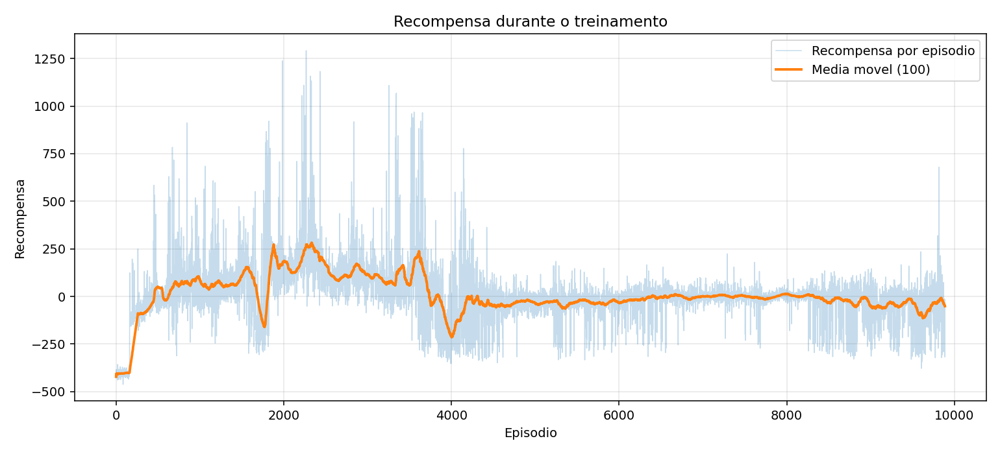
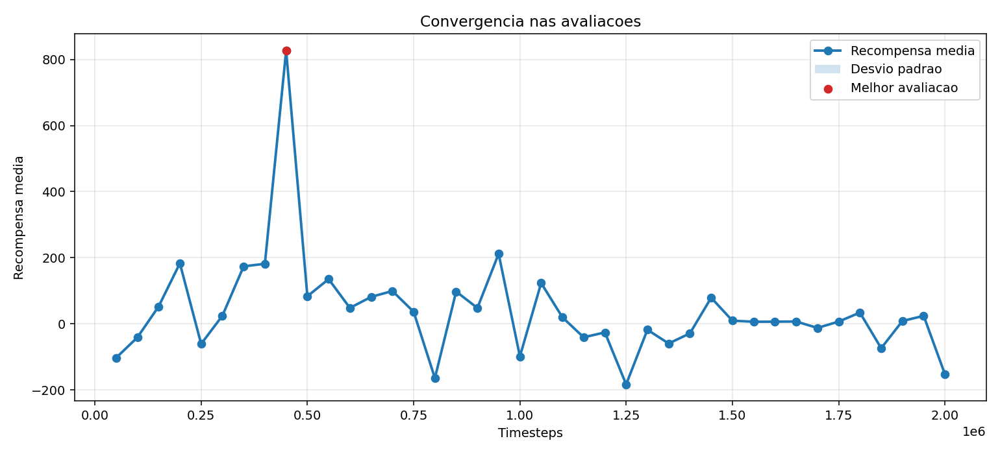
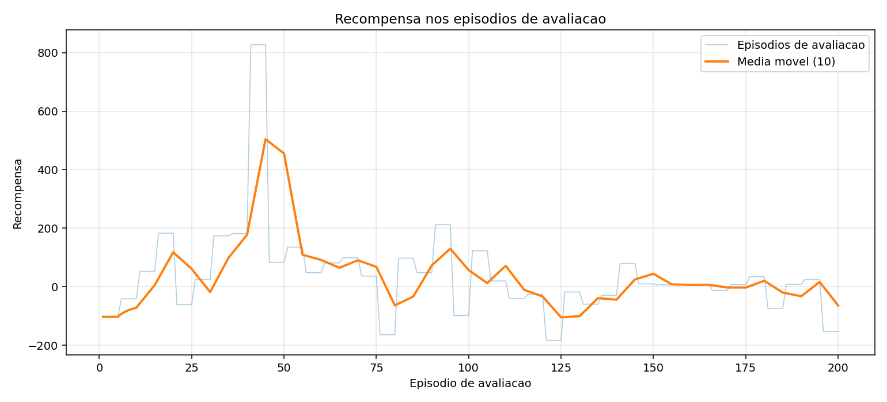

# treino_joelho_fluido_v1

- Registrado em: `2026-09-14T13:31:57.288642+00:00`
- Origem: `reinforcement_learning/saida_optuna_atom/treino_joelho_fluido_v1`
- Device: `cuda`
- Timesteps finais: `2000000`
- Frequencia de avaliacao: `50000`
- Episodios por avaliacao: `5`

## Modelos

- Melhor avaliacao: `reinforcement_learning/melhores_modelos/treino_joelho_fluido_v1/best_model.zip`
- Modelo final: `reinforcement_learning/melhores_modelos/treino_joelho_fluido_v1/final_model.zip`

## Graficos





## Ver no MuJoCo

```bash
python reinforcement_learning/ver_modelo_atom.py --modelo reinforcement_learning/melhores_modelos/treino_joelho_fluido_v1/best_model.zip
```

## TensorBoard

```bash
tensorboard --logdir reinforcement_learning/saida_optuna_atom/treino_joelho_fluido_v1/logs
```

## Parametros PPO

```json
{
  "learning_rate": 0.0008286946154789709,
  "n_steps": 512,
  "batch_size": 64,
  "n_epochs": 10,
  "gamma": 0.98,
  "gae_lambda": 0.95,
  "clip_range": 0.137826935848043,
  "ent_coef": 0.0,
  "vf_coef": 0.32937558580716303,
  "max_grad_norm": 0.5222902926081441
}
```

## Avaliacao

```json
{
  "train_monitor": {
    "episodes": 9887,
    "last_reward": -294.013617,
    "best_episode_reward": 1291.78496,
    "mean_last_10_reward": -145.6907721,
    "last_episode_length": 114,
    "elapsed_seconds": 1997.438655
  },
  "eval_monitor": {
    "episodes": 200,
    "last_reward": -152.628666,
    "best_episode_reward": 826.853651,
    "mean_last_10_reward": -64.2856555,
    "last_episode_length": 247,
    "elapsed_seconds": 1996.985425
  },
  "evaluations_npz": {
    "path": "reinforcement_learning/saida_optuna_atom/treino_joelho_fluido_v1/logs/evaluations.npz",
    "num_evaluations": 40,
    "best_mean_reward": 826.853651,
    "best_timestep": 450000,
    "last_mean_reward": -152.628666,
    "last_timestep": 2000000
  }
}
```
